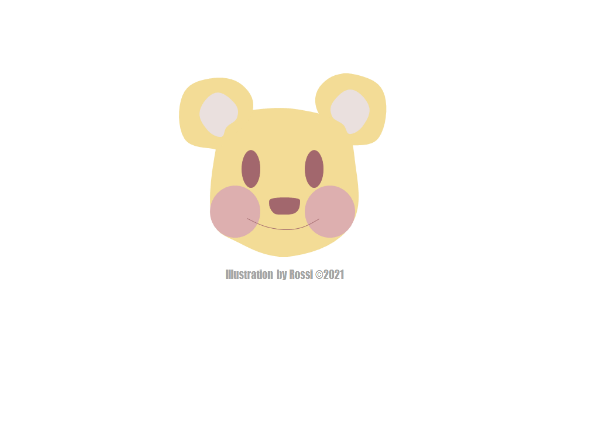

# 科技遇见她

## 分享你与科技的#HERstory

### 一小时编程挑战直播

_联合国开发计划署_
_联合国妇女署_
_Coding Girls Club_

> 在联合国#平等的一代#倡导活动的框架之下，联合国开发计划署（UNDP）与联合国妇女署（UN Women）共同发起#HERstory# #科技遇见她#倡议活动，聚焦科技领域、开启故事征集，将许多多个体的故事汇流成川，为广大有志进入科技领域的女性赋予信息。  

# HERstory
### 想要传递温暖可爱的插画师

在小的时候，我对数学并不是很敏感，当然现在也是，数学一直对我来说都是一门很难的学科，这也导致我在后期虽然对编程充满好奇和兴趣却止步不前，听到太多人在说：“你一个女孩，数学也学不好，你做不了代码的，别折腾了。”

可是编程所使用的每一个语句指令都是非常直接的，而这种“直接”对于长期在创作中浮沉的我来说是太有诱惑力的事。直接输入正确的语句就可以成功输出指令，这种执行方式让我感到安心，数据即使出现错误，也会很明显地体现在界面上，修改也很有针对性，每一种问题都有对应的解决方式。

是尘埃落定的一种安心。

这和艺术很不一样，在艺术领域内的创作非常依靠“灵感”和一些很难用语言文字描述记录的感觉，每每在创作上遇到瓶颈时，我就在想如果创作也可以像编程那样straightforward就好了。那些虚无缥缈的“感觉不太对劲”在创作中非常折磨人心，因经验和训练不足而无法辨别出到底是哪里不太对劲，在反复修改的时间中受到磨损的不只是手绘笔的笔尖，更是磨损着自己为数不多的“灵气”。  

这种时候我总是希望我可以更果断一些，更聪明一些，更符合大环境对女性约定俗成的要求：“像男孩那样，别那么敏感”。  

可是在艺术创作中，“敏感”是重要的特质，保持敏感才能从细微的生活缝隙中找出那些灵感，找出可能成为艺术的素材。“敏感”一直以来都是外界评价中的贬义词，一种所有人都在竭力避免被贴上的标签，我常常收到的反馈是：“你的画面完成度太低了，你的能力不太行。”久而久之我对自己的能力也产生了怀疑，变得很难去感知那些原本能使我感到快乐的事，在很长一段时间内一蹶不振，我原本以为这种困境会在进入大学后有短暂的喘息时间，实际上并没有，技术层面上差异的苦恼、无法通过练习提高的画面，甚至是受限于我自身性格偏向的配色方案，每一件压力都在扩大着我当时所处的困境，它越来越大，越来越大，画画从一件我非常热爱的事情变成了我最焦虑的梦魇。  

所以我想要把那些感受表达出来，以很笨拙的画法，以很粗糙的肌理。

我的作品风格一直不是市场内主流受众的选择，宏大、精细、震撼的大制作是主流的选择，宏大的场面一定是需要存在的，但是我也很希望像我这样的风格也可以收到同等的接纳，特别是在经历过Covid-19后，我在进入我们志愿者团队后才感受到温情的作品在灾难的环境中对人们有多大的治愈力。  
就像之前我并不知道我也能够搭建起我自己的个人网站，上传我自己的作品，但是现在我做到了呢，我想我的风格也会有被接纳的一天。

